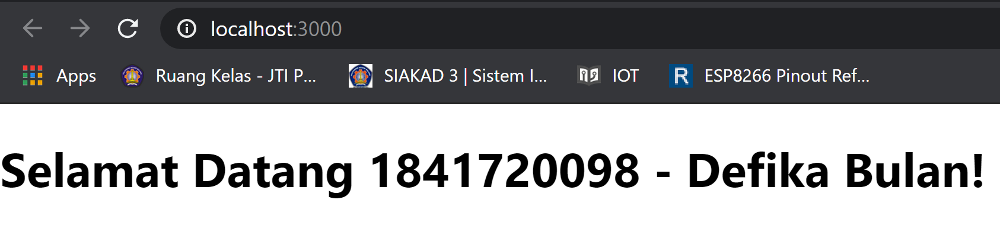

# 04 - Konsep ReactJs - Bagian 2

## Tujuan Pembelajaran

1. Mahasiswa memahami konsep interaksi dalam ReactJS
2. Mahasiswa dapat membuat interaksi ReactJS dengan API

## Hasil Praktikum

[Kode Program Praktikum1 - Cara 1](../../src/04_konsep_reactjs_part2/praktikum1/index-cara1.js)

[Kode Program Praktikum1 - Cara 2](../../src/04_konsep_reactjs_part2/praktikum1/index-cara2.js)

[Kode Program Praktikum1 - Cara 3](../../src/04_konsep_reactjs_part2/praktikum1/index-cara3.js)

[Kode Program Praktikum2](../../src/04_konsep_reactjs_part2/praktikum2/index.js)

[Kode Program Praktikum3](../../src/04_konsep_reactjs_part2/praktikum3/index.js)

[Kode Program Praktikum4](../../src/04_konsep_reactjs_part2/praktikum4/index.js)

[Kode Program Praktikum5](../../src/04_konsep_reactjs_part2/praktikum5/index.js)

[Kode Program Praktikum 6.1](../../src/04_konsep_reactjs_part2/praktikum6/index-form.js)

[Kode Program Praktikum 6.2](../../src/04_konsep_reactjs_part2/praktikum6/index-textarea.js)

[Kode Program Praktikum 6.3](../../src/04_konsep_reactjs_part2/praktikum6/index-select.js)

[Kode Program Praktikum 6.4](../../src/04_konsep_reactjs_part2/praktikum6/index-multiple-select.js)
