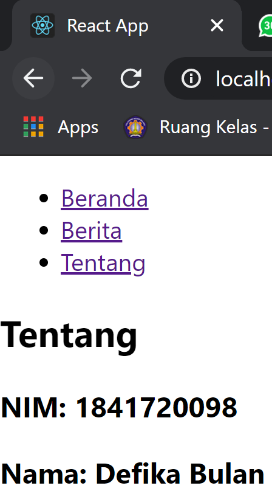

# 05 - API dan Router di ReactJs

## Tujuan Pembelajaran

1. Mahasiswa memahami konsep interaksi dalam ReactJS
2. Mahasiswa dapat membuat interaksi ReactJS dengan API
3. Mahasiswa memahami konsep React Router
4. Mahasiswa dapat melakukan instalasi React Router
5. Mahasiswa dapat membuat fitur berpindah halaman dengan React Router

## Hasil Praktikum

[Kode Program Praktikum 1](../../src/05_API_Router_ReactJs/praktikum1/index.js)

[Kode Program Index.JS Praktikum 2](../../src/05_API_Router_ReactJs/praktikum2/index.js)

[Kode Program App.JS Praktikum 2](../../src/05_API_Router_ReactJs/praktikum2/App.js)

[Kode Program Praktikum 3](../../src/05_API_Router_ReactJs/praktikum3/App.js)

[Kode Program Tugas](../../src/05_API_Router_ReactJs/tugas/App.js)
