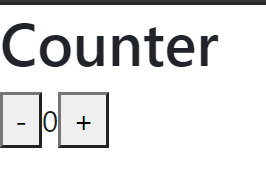
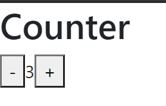
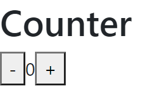
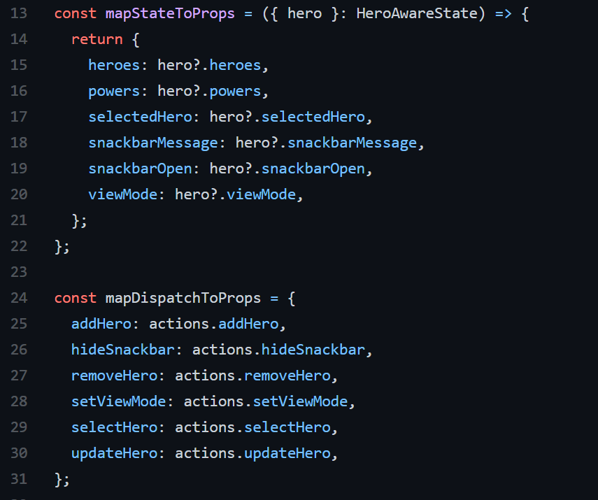

# 06 - React Redux

## Tujuan Pembelajaran

1. Mahasiswa dapat memahami konsep state management dalam redux
2. Mahasiswa dapat menerapkan redux dalam reactapp

## Hasil Praktikum

[Kode Program Praktikum 1 : Index.js](../../src/06_React_Redux/praktikum1/index.js)

[Kode Program Praktikum 1 : App.js](../../src/06_React_Redux/praktikum1/App.js)

[Kode Program Praktikum 2 : Index.js](../../src/06_React_Redux/praktikum2/index.js)

[Kode Program Praktikum 2 : App.js](../../src/06_React_Redux/praktikum2/App.js)

[Kode Program Praktikum 3 : Index.js](../../src/06_React_Redux/praktikum3/index.js)

[Kode Program Praktikum 3 : App.js](../../src/06_React_Redux/praktikum3/App.js)

## Pertanyaan

1.  Jelaskan maksud sintaks this.props.dispatch pada praktikum langkah 16 sebelumnya!

        Jawab : menerima dispatch() dan mengembalikan alat-alat panggilan balik yang ingin dimasukkan ke dalam komponen presentasi.

2.  Jelaskan maksud istilah yang ada dalam Redux berikut ini:

    - Actions : Merupakan objek memiliki properti type berupa String yang memberitahu reducer untuk memodifikasi data. Action juga dapat menampung data dengan cara menambahkan properti kedua dalam object actionnya.

    - Reducers : Merupakan bagian redux yang merubah state menjadi respon yang terjadi ketika actions di dispatch(). untuk merubah state hanya bisa dilakukan dengan reducer dan reducer hanya melakukan perubahan state jika ada action di dispatch(). Dapat dibilang reducer adalah sebuah fungsi yang mengembalikan state baru.

    - Action creators : Merupakan suatu fungsi yang mengembalikan nilai action. Action ini yang akan diteruskan ke reducer untuk diolah oleh store. Fungsi action creator ini akan di panggil ketika ada interaksi dari user

    - Middleware : Middleware merupakan sebuah alat yang digunakan untuk merubah hasil dari request sebelum masuk menjadi response

    - Pure functions : Merupakan fungsi yang memberi nilai balik yang sama selama argumennya sama. Tidak merubah (mutate) objek atau variabel lain dan juga tidak tergantung/terpengaruh objek atau variabel lain

    - Immutability : suatu value yang tidak bisa diubah ketika sudah dideklarasikan

3.  Jelaskan maksud sintaks export default connect(mapStateToProps)(Counter) pada praktikum langkah 9 sebelumnya!

        Jawab : menerima counter store sebagai argumen. Ini mengembalikan objek yang menggambarkan bagaimana keadaan store dipetakan ke dalam properti.

4.  Carilah sebuah studi kasus aplikasi yang cukup kompleks di GitHub yang memanfaatkan Redux! Kemudian screenshot bagian kode program mana yang merupakan proses Redux dan jelaskan prosesnya! (cantumkan link repository GitHub yang Anda temukan)

Jawab : https://github.com/jfcere/react-redux-sample/blob/master/src/hero/hero.tsx

Penjelasan proses : Pada aplikasi ini react-redux digunakan untuk membuat CRUD. Pada bagian yang di screenshoot redux digunakan untuk create dan delete data.
