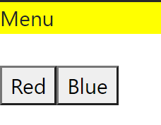
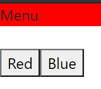
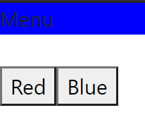

# 07 - Context dan HOC

## Tujuan Pembelajaran

1. Mahasiswa mengetahui dan memahami konsep Context dan HOC dalam reactApp
2. Mahasiswa dapat membuat HOC dengan context API

## Hasil Praktikum

[Kode Program Praktikum : Index.js](../../src/07_Context_HOC/index.js)

[Kode Program Praktikum : App.js](../../src/07_Context_HOC/App.js)

[Kode Program Praktikum : Menu.js](../../src/07_Context_HOC/Menu.js)

[Kode Program Praktikum : SetColor.js](../../src/07_Context_HOC/SetColor.js)

[Kode Program Praktikum : theme-context.js](../../src/07_Context_HOC/ThemeContext/theme-context.js)

[Kode Program Praktikum : ThemeProvider.js](../../src/07_Context_HOC/ThemeContext/ThemeProvider.js)

[Kode Program Praktikum : withTheme.js](../../src/07_Context_HOC/ThemeContext/withTheme.js)
