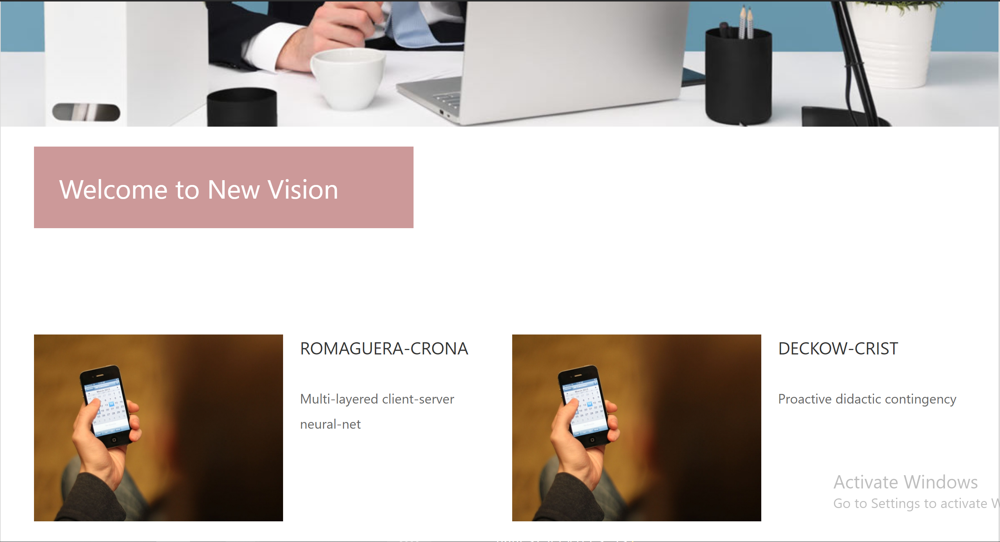

# 08 - UJIAN TENGAH SEMESTER

Mata Kuliah : Pemrograman Berbasis Framework, Jurusan Teknologi Informasi, Polinema

Dosen Pengampu : Habibie Ed Dien, S.Kom., M.T.

# Identitas Mahasiswa

NIM : 1841722098

Nama : Defika Bulan

Kelas : TI-3C

# Soal

Mengubah HTML statis menjadi komponen-komponen React menjadi sebuah Single-Page Application (SPA).

Materi : ReactJS, Api Router ReactJS, Redux

# Komponen Aplikasi

Template 10 : https://s.id/templat-web

Resource file JSON : https://jsonplaceholder.typicode.com/users

# Fitur-Fitur aplikasi

## Konten Web dengan API(GET) JSON pada halaman HOME

## Menu HOME

[Kode Program Praktikum : Home.js](../../src/08_UTS/uts/src/pages/Home.js)

## - Menu ABOUT OUR COMPANY

[Kode Program Praktikum : Company.js](../../src/08_UTS/uts/src/pages/Company.js)

## - Menu OUR SERVICES

[Kode Program Praktikum : Services.js](../../src/08_UTS/uts/src/pages/Services.js)

## - Menu CONTACT US

[Kode Program Praktikum : Contact.js](../../src/08_UTS/uts/src/pages/Contact.js)
