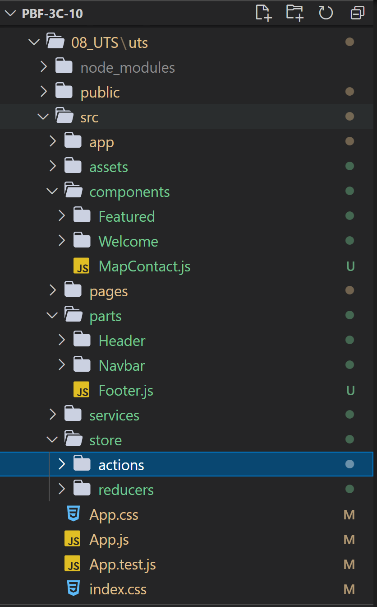

# 08 - UJIAN TENGAH SEMESTER

Mata Kuliah : Pemrograman Berbasis Framework, Jurusan Teknologi Informasi, Polinema

Dosen Pengampu : Habibie Ed Dien, S.Kom., M.T.

# Identitas Mahasiswa

NIM : 1841722098

Nama : Defika Bulan

Kelas : TI-3C

# Soal

Mengubah HTML statis menjadi komponen-komponen React menjadi sebuah Single-Page Application (SPA).

Materi : ReactJS, Api Router ReactJS, Redux

# Komponen Aplikasi

Template 10 : https://s.id/templat-web

Resource file JSON : [listHome.json](../../src/08_UTS/uts/listHome.json)

# Struktur Folder Pengerjaan

# Fitur-fitur aplikasi

Kode Program UTS : [Home.js](../../src/08_UTS/uts/src/pages/Home.js)

Kode Program UTS : [Company.js](../../src/08_UTS/uts/src/pages/Company.js)

Kode Program UTS : [Services.js](../../src/08_UTS/uts/src/pages/Services.js)

Kode Program UTS : [Contact.js](../../src/08_UTS/uts/src/pages/Contact.js)

# Penggunaan React Router & Redux

- App

Kode Program UTS : [App.js](../../src/08_UTS/uts/src/App.js)

- Action

Kode Program UTS : [actionTypes.js](../../src/08_UTS/uts/src/store/actions/actionsTypes.js)

- Reducers

Kode Program UTS : [PostReducer.js](../../src/08_UTS/uts/src/store/reducers/PostReducer.js)

- Ambil Data API menggunakan Redux

Kode Program UTS : [WelcomeHome.js](../../src/08_UTS/uts/src/components/Welcome/WelcomeHome.js)

# Penggunaan API File JSON

Kode Program UTS : [PostService.js](../../src/08_UTS/uts/src/services/PostService.js)
