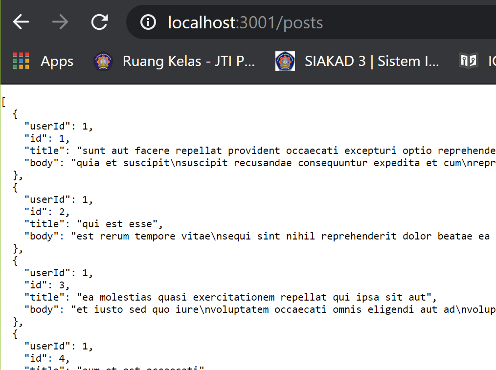
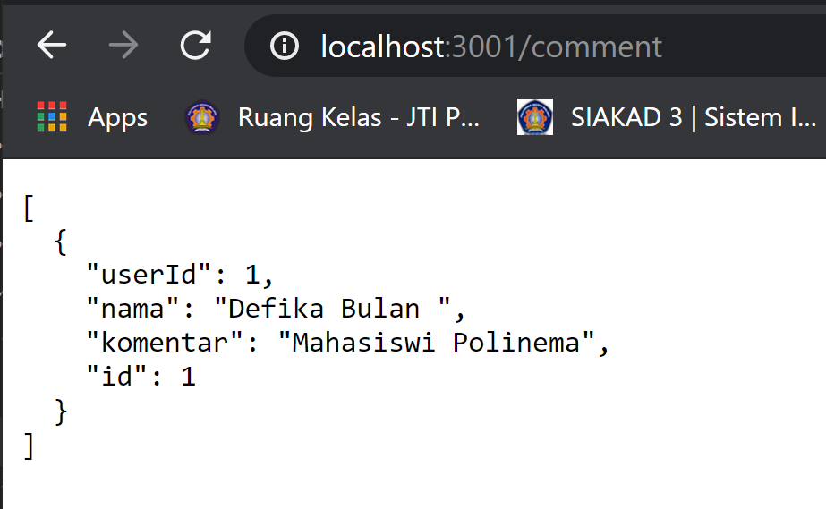

# 09 - Global API dan Hooks

## Tujuan Pembelajaran

1. Mahasiswa mengetahui dan memahami konsep Global API
2. Mahasiswa dapat membuat interaksi dengan global API dan React Hooks

## Hasil Praktikum

### **Praktikum 1a. Membuat Global API Service GET & Membuat Restful API Lokal**

[Kode Program Praktikum : Components/BlogPost.js](../../src/09_Global_Api_Hooks/praktikum1a/components/BlogPost.js)

[Kode Program Praktikum : Service/index.js](../../src/09_Global_Api_Hooks/praktikum1a/services/index.js)

[Kode Program Praktikum : App.js](../../src/09_Global_Api_Hooks/praktikum1a/App.js)

[Kode Program Praktikum : index.js](../../src/09_Global_Api_Hooks/praktikum1a/index.js)

[Kode Program Praktikum : listArtikel.json](../../src/09_Global_Api_Hooks/praktikum1a/listArtikel.json)

### **Praktikum 1b.Membuat Global API Service POST**

[Kode Program Praktikum : Components/BlogPost.js](../../src/09_Global_Api_Hooks/praktikum1b/components/BlogPost.js)

[Kode Program Praktikum : Service/index.js](../../src/09_Global_Api_Hooks/praktikum1b/services/index.js)

### **Praktikum 1c.Membuat Global API Service DELETE**

[Kode Program Praktikum : Components/BlogPost.js](../../src/09_Global_Api_Hooks/praktikum1c/components/BlogPost.js)

[Kode Program Praktikum : Service/index.js](../../src/09_Global_Api_Hooks/praktikum1c/services/index.js)

### **Praktikum 1d.Mengelola Global API Service**

[Kode Program Praktikum : Components/BlogPost.js](../../src/09_Global_Api_Hooks/praktikum1d/components/BlogPost.js)

[Kode Program Praktikum : API/Config.js](../../src/09_Global_Api_Hooks/praktikum1d/API/Config.js)

[Kode Program Praktikum : API/Delete.js](../../src/09_Global_Api_Hooks/praktikum1d/API/Delete.js)

[Kode Program Praktikum : API/Get.js](../../src/09_Global_Api_Hooks/praktikum1d/API/Get.js)

[Kode Program Praktikum : API/Post.js](../../src/09_Global_Api_Hooks/praktikum1d/API/Post.js)

[Kode Program Praktikum : Artikel/index.js](../../src/09_Global_Api_Hooks/praktikum1d/Artikel/index.js)

### **Tugas Praktikum 1**

[Kode Program Praktikum : services/Komentar/index.js](../../src/09_Global_Api_Hooks/tugas/services/Komentar/index.js)

[Kode Program Praktikum : components/Komentar.js](../../src/09_Global_Api_Hooks/tugas/components/Komentar.js)

[Kode Program Praktikum : App.js](../../src/09_Global_Api_Hooks/tugas/App.js)

[Kode Program Praktikum : listArtikel.json](../../src/09_Global_Api_Hooks/tugas/listArtikel.json)
