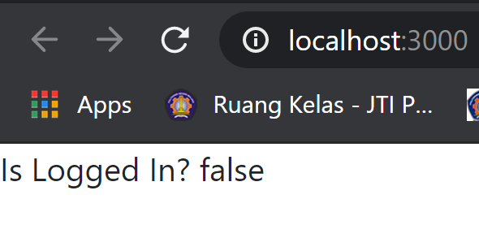

# 10 - Firebase di ReactJS

## Tujuan Pembelajaran

1. Mahasiswa mengetahui dan memahami konsep firebase

2. Mahasiswa dapat membuat koneksi ke firebase dengan ReactJS

## Hasil Praktikum

### Praktikum 1

[Kode Program Praktikum : Components/Header.js](../../src/10_Firebase_ReactJS/components/Header.js)

[Kode Program Praktikum : Components/Register.js](../../src/10_Firebase_ReactJS/components/Register.js)

[Kode Program Praktikum : Components/routes.js](../../src/10_Firebase_ReactJS/components/routes.js)

[Kode Program Praktikum : App.js](../../src/10_Firebase_ReactJS/App.js)

[Kode Program Praktikum : App.css](../../src/10_Firebase_ReactJS/App.css)
