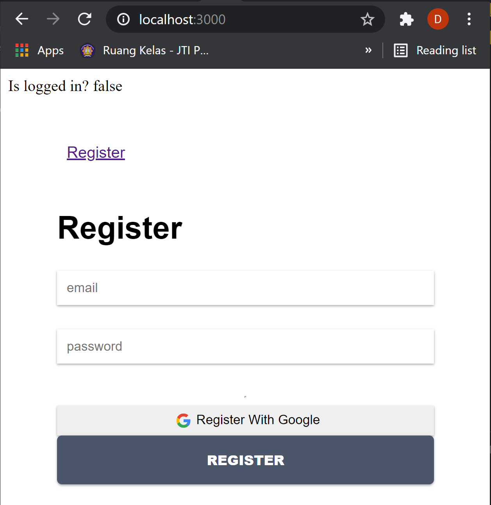
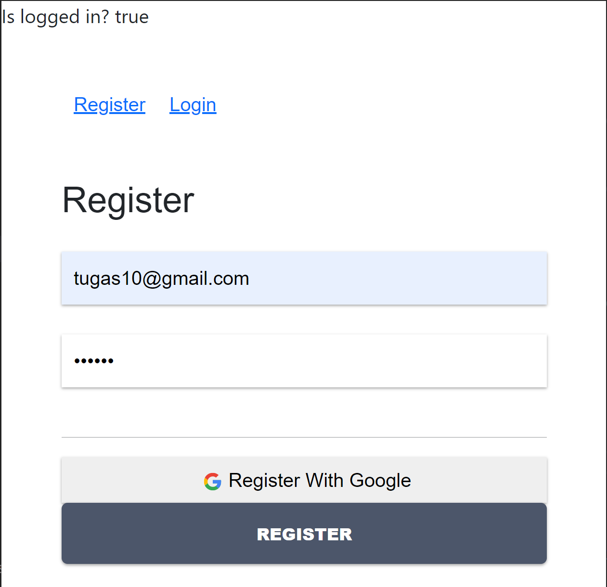

# 10 - Firebase di ReactJS

## Tujuan Pembelajaran

1. Mahasiswa mengetahui dan memahami konsep firebase

2. Mahasiswa dapat membuat koneksi ke firebase dengan ReactJS

## Hasil Praktikum

### Praktikum 1 dan 2

[Kode Program Praktikum : Components/Header.js](../../src/10_Firebase_ReactJS/praktikum1&2/components/Header.js)

[Kode Program Praktikum : Components/Register.js](../../src/10_Firebase_ReactJS/praktikum1&2/components/Register.js)

[Kode Program Praktikum : Components/Login.js](../../src/10_Firebase_ReactJS/praktikum1&2/components/Login.js)

[Kode Program Praktikum : Components/routes.js](../../src/10_Firebase_ReactJS/praktikum1&2/components/routes.js)

[Kode Program Praktikum : App.js](../../src/10_Firebase_ReactJS/praktikum1&2/App.js)

[Kode Program Praktikum : App.css](../../src/10_Firebase_ReactJS/praktikum1&2/App.css)

### Praktikum 3

[Kode Program Praktikum : Components/Register.js](../../src/10_Firebase_ReactJS/praktikum3/components/Register.js)

[Kode Program Praktikum : App.js](../../src/10_Firebase_ReactJS/praktikum3/App.js)

[Kode Program Praktikum : firebase.config.js](../../src/10_Firebase_ReactJS/praktikum3/firebase.config.js)

### Tugas 1

**- Menambah aksi pada tombol "Login with Google"**

**- Menambah aksi pada tombol "Logout"**

### Tugas 2

**- Menambah animasi loading saat melakukan registrasi**

**- Menambah animasi loading saat melakukan login**

### **Sintaks Tugas**

[Kode Program Tugas : components/Login.js](../../src/10_Firebase_ReactJS/tugas/components/Login.js)

[Kode Program Tugas : components/Register.js](../../src/10_Firebase_ReactJS/tugas/components/Register.js)

[Kode Program Tugas : App.css](../../src/10_Firebase_ReactJS/tugas/App.css)
