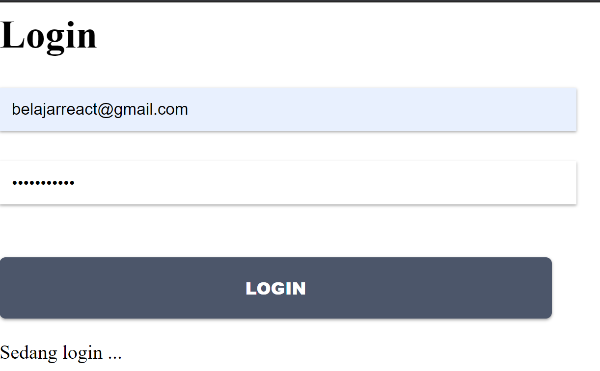
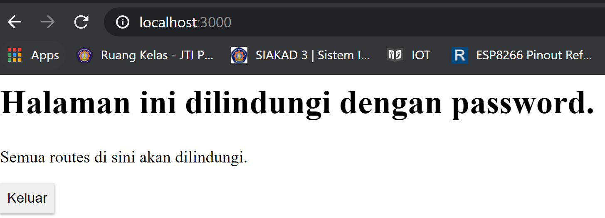
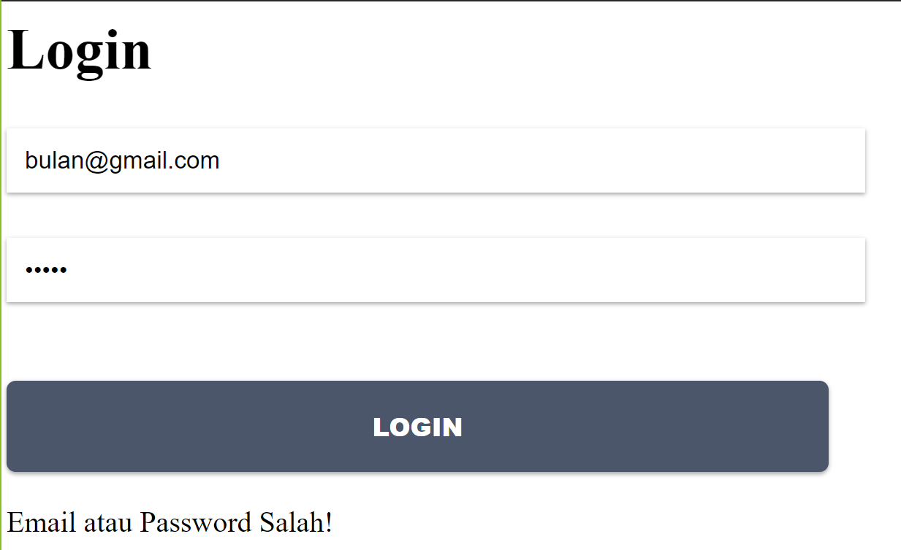
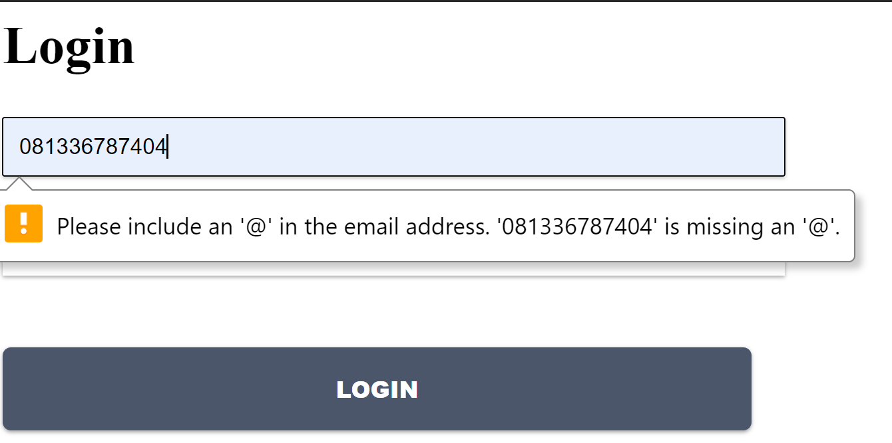
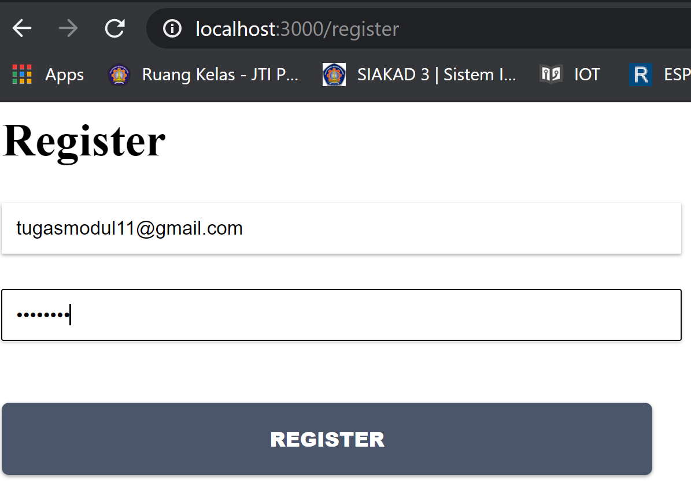
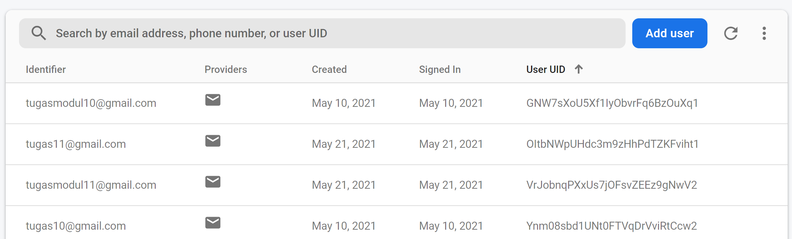

# 11 - Redux Thunk

## Tujuan Pembelajaran

1. Mahasiswa memahami konsep redux thunk pada project ReactJS

2. Mahasiswa dapat melakukan instalasi dan konfigurasi redux thunk pada project ReactJS

## Hasil Praktikum

### Praktikum

[Kode Program Praktikum : Components/Login.js](../../src/11_Redux_Thunk/praktikum/components/Login.js)

[Kode Program Praktikum : Components/Home.js](../../src/11_Redux_Thunk/praktikum/components/Home.js)

[Kode Program Praktikum : redux/actions/auth.js](../../src/11_Redux_Thunk/praktikum/redux/actions/auth.js)

[Kode Program Praktikum : redux/reducers/auth.js](../../src/11_Redux_Thunk/praktikum/redux/reducers/auth.js)

[Kode Program Praktikum : redux/reducers/index.js](../../src/11_Redux_Thunk/praktikum/redux/reducers/index.js)

[Kode Program Praktikum : redux/configureStore.js](../../src/11_Redux_Thunk/praktikum/redux/configureStore.js)

[Kode Program Praktikum : routes/ProtectedRoute.js](../../src/11_Redux_Thunk/praktikum/routes/ProtectedRoute.js)

[Kode Program Praktikum : App.js](../../src/11_Redux_Thunk/praktikum/App.js)

[Kode Program Praktikum : Root.js](../../src/11_Redux_Thunk/praktikum/Root.js)

[Kode Program Praktikum : firebase.config.js](../../src/11_Redux_Thunk/praktikum/firebase.config.js)

### Tugas

1. Berdasarkan praktikum yang telah Anda lakukan, jelaskan perbedaan fitur yang ada dalam komponen Login dan Home! Mengapa komponen Login tidak menggunakan class seperti pada komponen Home ?

**Jawab:**

Pada fitur login dibutuhkan data yang terdapat di firebase, sedangkan fitur home hanya berupa hasil tampilan dari proses login yang telah di verifikasi oleh firebase

Komponen Login tidak menggunakan class untuk mempersingkat alur yang berjalan disistem dan baris sintaks nya lebih ringkas daripada menggunakan class

2. Jelaskan kegunaan dan alur logika dari protectedRoute.js !

**Jawab:**

- Kegunaan: Untuk memberikan alur pada halaman yang terproteksi, sehingga user tidak bisa masuk ke halaman tersebut sebelum melakukan login dengan menginputkan data yang benar.

- Alur: Data diinputkan ketika login, lalu sistem akan mengecek apakah data yang diinputkan sesuai. Jika sesuai dan benar maka sistem akan mengarahkan ke Halaman Home, jika salah maka sistem akan melakukan re-direct ke halaman Login kembali.

3. Coba lakukan login dengan email atau password yang salah, apa yang terjadi? Jelaskan!

**Jawab:**

Pada gambar dibawah ini, sistem menunjukkan sebuah peringatan bahwa email atau password yang diinputkan tidak sesuai dengan data yang ada di firebase

Pada gambar dibawah ini, sistem tidak dapat menerima inputan data berupa number atau kalimat yang tidak memiliki '@mail.com'

4. Jika Anda berada di halaman Home, coba akses form login tanpa melakukan logout. Apakah form login bisa diakses? Jelaskan!

**Jawab:**

Form login tidak dapat diakses jika tidak melakukan logout terlebih dahulu. Hal ini terjadi karena sistem sudah dirancang sedemikian rupa dengan metode session.

5. Tambahkan menu Register pada form login sehingga user yang belum terdaftar dapat melakukan registrasi! Jika registrasi sukses, maka user langsung diarahkan ke halaman Home.

**Jawab:**

[Kode Program Praktikum : actions/auth.js](../../src/11_Redux_Thunk/tugas/actions/auth.js)

[Kode Program Praktikum : components/Register.js](../../src/11_Redux_Thunk/tugas/components/Register.js)

[Kode Program Praktikum : reducers/auth.js](../../src/11_Redux_Thunk/tugas/reducers/auth.js)

[Kode Program Praktikum : Root.js](../../src/11_Redux_Thunk/tugas/Root.js)
