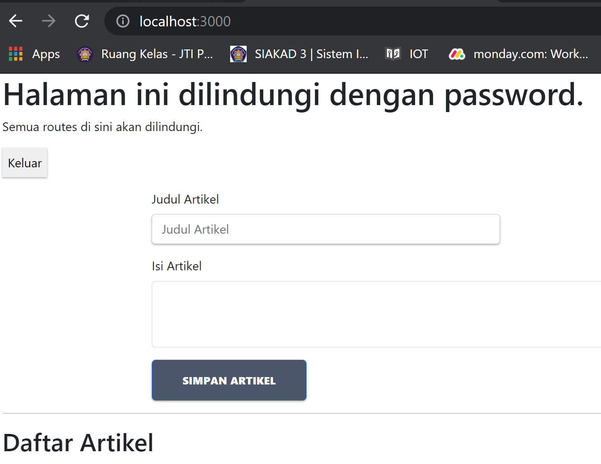
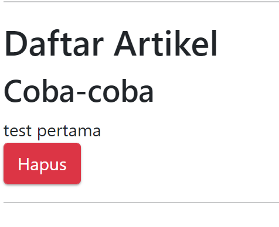
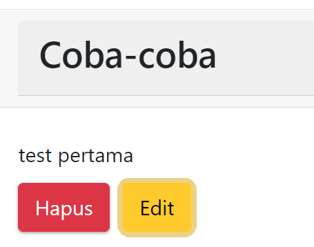
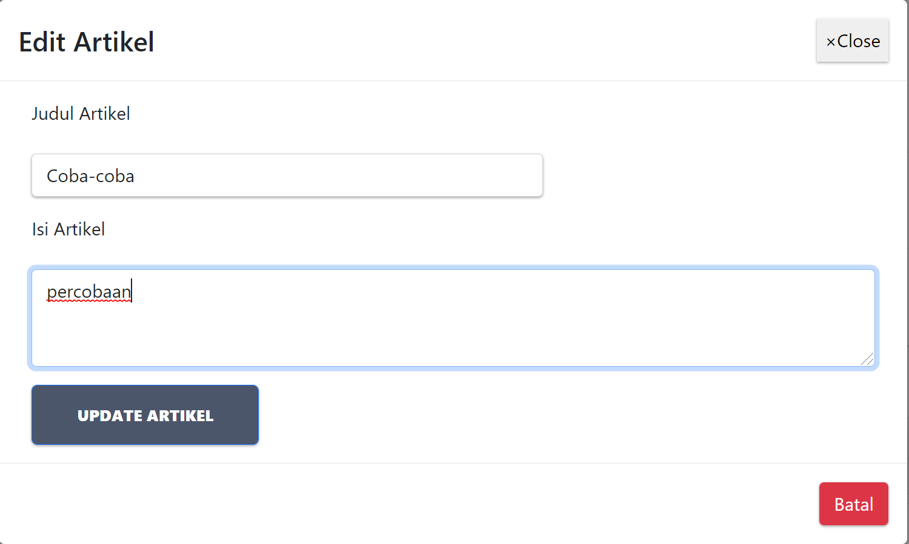
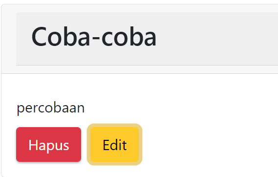
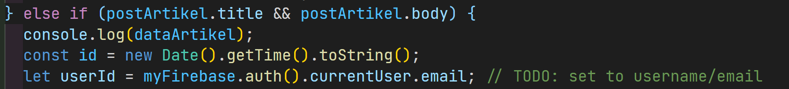
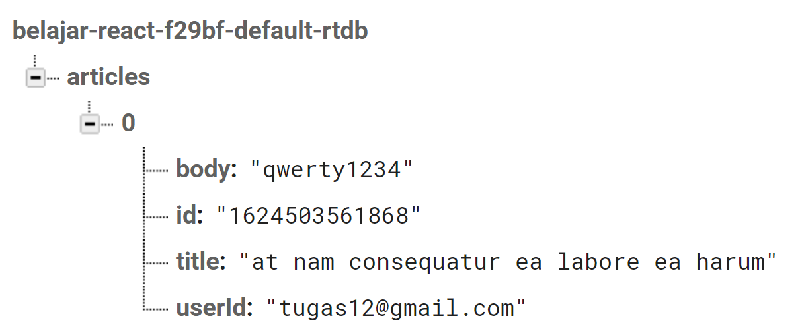
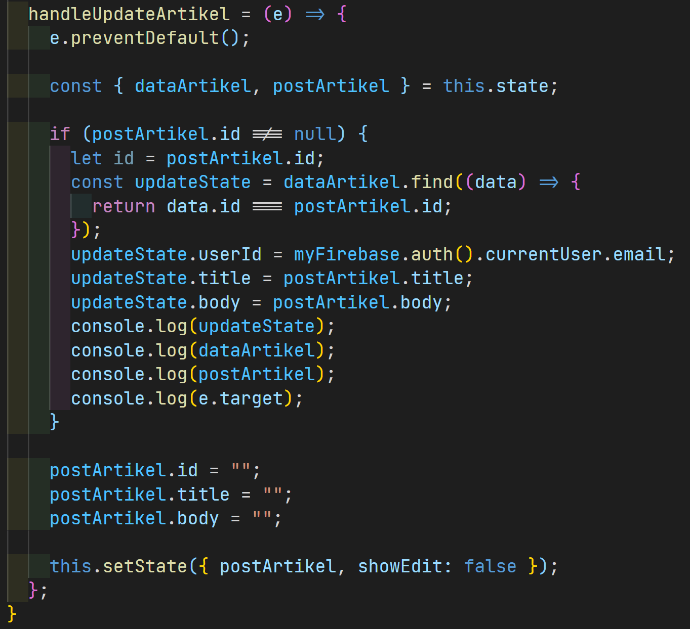

# 12 - Firebase dan ReactJS

## Tujuan Pembelajaran

1. Mahasiswa memahami konsep interaksi dengan firebase

2. Mahasiswa dapat membuat komunikasi CRUD ke firebase dengan ReactJS

## Hasil Praktikum

### Praktikum 1,2, dan 3

[Kode Program Praktikum : Components/BlogPost.js](../../src/12_Crud_Firebase/praktikum1,2,3/components/BlogPost.js)

[Kode Program Praktikum : Components/Home.js](../../src/12_Crud_Firebase/praktikum1,2,3/components/Home.js)

[Kode Program Praktikum : firebase.config.js](../../src/12_Crud_Firebase/praktikum1,2,3/firebase.config.js)

### Praktikum 4

[Kode Program Praktikum : Components/BlogPost.js](../../src/12_Crud_Firebase/praktikum4/BlogPost.js)

## Tugas

1.  Berdasarkan praktikum 1 yang telah Anda lakukan, jelaskan perbedaan fungsi locked mode dan test mode pada langkah 3 saat Anda konfigurasi database Firebase?

        Jawab : Perbedaan dari fungsi locked mode dan test mode terletak pada penulisan dan pembacaan data, ketika locked mode maka data tidak akan bisa diakses maupun diolah karena pada pengaturannya diatur false dan sebaliknya pada test mode, data bisa diakses dan diolah.

2.  Buatlah variabel userId pada praktikum 2 langkah 4 agar dapat menyimpan email dari user yang sedang login, sehingga dapat tersimpan di database!

Jawab:

- Code
  
  [Kode Program Tugas : BlogPost.js](../../src/12_Crud_Firebase/tugas/BlogPost.js)

- Hasil
  

3.  Jelaskan maksud kode ini (dataArtikel || []) pada praktikum 2 langkah 6! Mengapa berbeda dari codelabs sebelumnya untuk menampilkan daftar artikel?

        Jawab : Maksud dari kode (dataArtikel || []) adalah untuk menampilkan map data dalam bentuk array ataupun objek berbeda dengan praktikum sebelumnya dimana data yang diambil hanya berbentuk objek.

4.  Lengkapilah kode pada praktikum 4 langkah 5 agar dapat melakukan update artikel! Mengapa setelah klik tombol Update Artikel, form Modal tidak hilang? Bagaimana Anda mengatasi hal tersebut?

Jawab : Form Modal tidak hilang dikarenakan showEdit tidak diubah menjadi true

5.  Ketika Anda menekan tombol Edit, lalu menekan tombol Batal pada form Modal update artikel. Kemudian coba tambah artikel baru, maka artikel yang tadi kita klik tombol Edit akan berubah jadi data yang artikel baru ditambahkan. Mengapa demikian? Silakan diperbaiki.

        Jawab : Ketika menekan tombol Edit, lalu menekan tombol Batal pada form Modal update artikel kemudian ditambahkan artikel baru, maka artikel yang tadi kita klik tombol Edit akan berubah jadi data yang artikel baru ditambahkan semua itu karena pada onSubmit masih memanggil fungsi handleTombolSimpan. sehingga data baru akan tersimpan.
