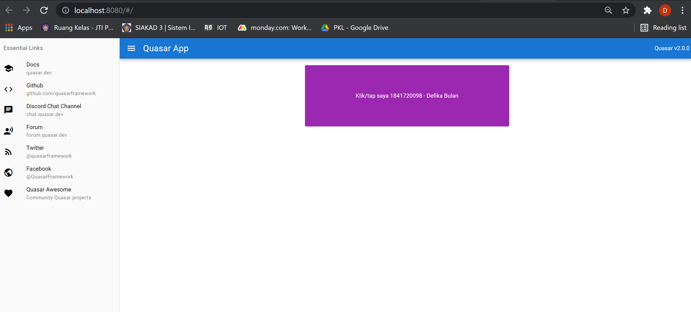
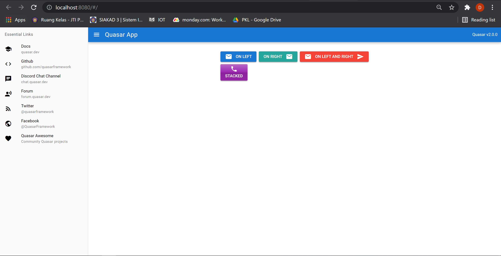
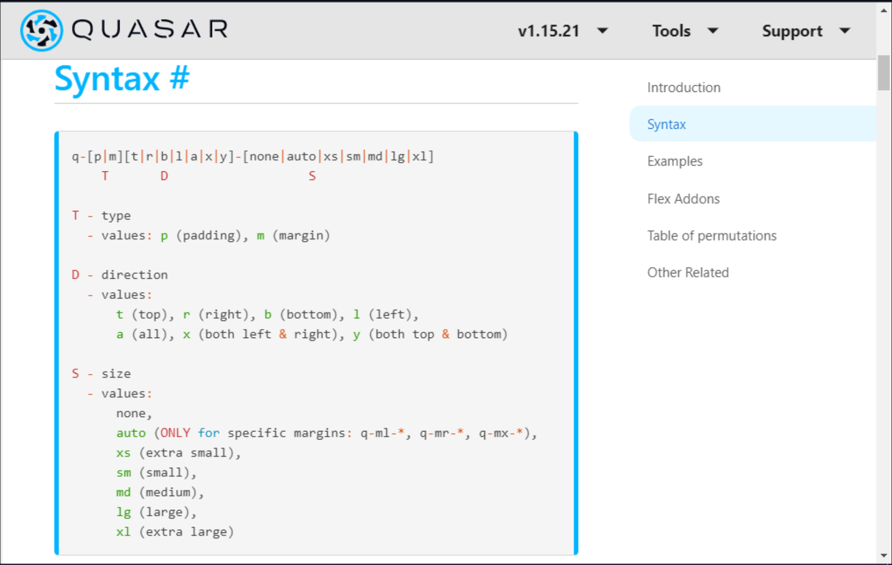
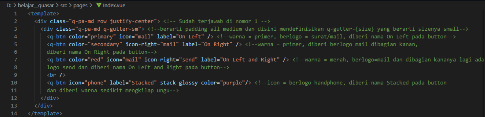

# 14 - Quasar Directives Components

## Tujuan Pembelajaran

1. Mampu menerapkan Quasar Directives

2. Mampu menerapkan Quasar Components

## Hasil Praktikum

### Praktikum 1

[Kode Program Praktikum 1 : Index.vue](../../src/14_Quasar_Directives_Components/praktikum1/Index.vue)

[Kode Program Praktikum 1 : quasar.conf.js](../../src/14_Quasar_Directives_Components/praktikum1/quasar.conf.js)

### Praktikum 2

[Kode Program Praktikum 2 : Index.vue](../../src/14_Quasar_Directives_Components/praktikum2/Index.vue)

[Kode Program Praktikum 2 : quasar.conf.js](../../src/14_Quasar_Directives_Components/praktikum2/quasar.conf.js)

## Tugas

1. Berdasarkan praktikum 1 yang telah Anda lakukan, jelaskan maksud kode di template: class="q-pa-md row justify-center" ?

Jawab : Ada kelas CSS yang disediakan oleh Quasar untuk membantu mengatur jarak untuk elemen atau komponen DOM. Semua opsi diawali dengan q- dan kemudian dipecah menjadi type (T), direction (D), dan size (S). Yang berarti Tipe pa adalah padding, Tujuan/direksi a adalah all, dan ukurannya md adalah medium pada posisi justify center.

2. Berdasarkan praktikum 1 pada langkah nomor 4, jelaskan maksud script tersebut seperti kegunaan konstanta colors, fungsi data(), computed, mounted, dan beforeDestroy() !

Jawab :

- colors digunakan untuk memberi warna pada komponen grafis.

- data() untuk mengambil data

- computed Apabila Vue di inisiasikan, properti pada computed aka dikonversikan menjadi properti Vue getter atau setter. Pada dasarnya dapat menganggap nilai yang dihitung sebagai nilai turunan yang akan diperbarui secara otomatis setiap kali salah satu nilai dasar yang digunakan untuk menghitungnya diperbarui dan tidak memanggil yang dihitung dan tidak menerima parameter apa pun. Bisa mereferensikan properti yang dihitung seperti halnya properti data.

- mounted Sering digunakan di lifecycle hook pada Vue. Vue memanggil mounted ketika komponen ditambahkan di DOM. Ini paling sering digunakan untuk mengirim permintaan HTTP untuk mengambil data yang kemudian akan dirender oleh komponen.

- beforeDestroy() Siklus hidup Vue ini dipanggil tepat sebelum instance Vue dihancurkan, instance dan semua fungsi masih utuh dan berfungsi di sini. Ini adalah tahap di mana Anda dapat melakukan manajemen, menghapus variabel dan membersihkan komponen.

3. Berdasarkan praktikum 2 pada langkah nomor 2, jelaskan maksud tiap kode HTML pada template yang mendefinisikan tiap button tersebut!

Jawab : 

4. Coba ganti kode template HTML pada praktikum 2 menjadi seperti berikut. Save file, lalu perhatikan apa yang terjadi ? Mengapa terjadi demikian, jelaskan!

Jawab :
semua icon berpindah ke sisi kiri karna kode sebelumnya menggunakan justify-center untuk memposisikan semua icon di tengah
